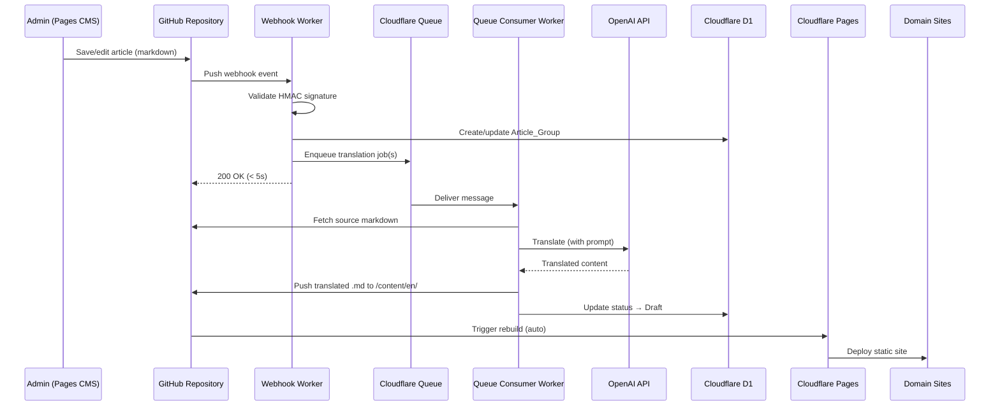
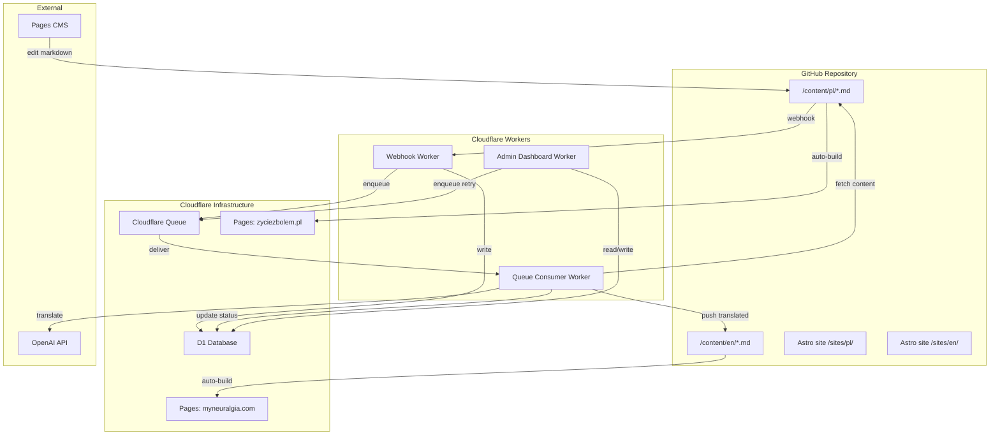
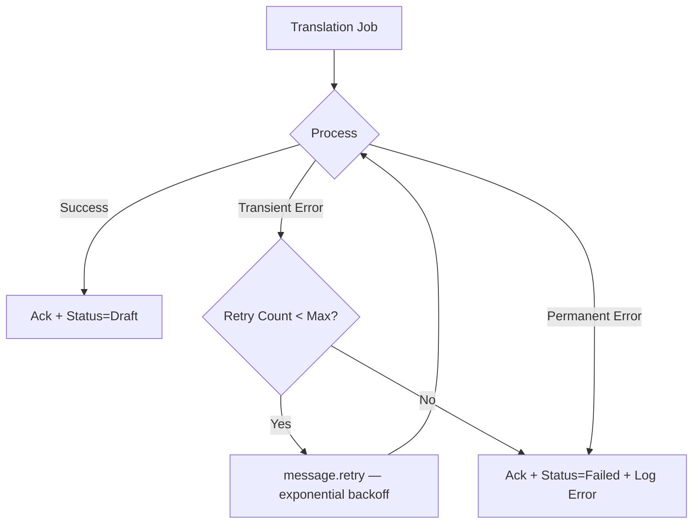

# Design Document: Multilingual CMS

## Overview

A zero-maintenance multilingual blog system for Trigeminal Neuralgia content, built entirely on Cloudflare's free-tier serverless platform. Polish articles authored via Pages CMS are automatically translated to English (and future languages) using OpenAI, then published as static Astro sites on separate Cloudflare Pages projects — one per domain.

**Design Principles:**
- KISS — minimal moving parts, no servers to manage
- Zero maintenance after initial deployment
- Non-technical admin interacts only through Pages CMS and a simple dashboard
- Everything runs on Cloudflare free tier + OpenAI API costs only

## Architecture

### System Flow Diagram



### Deployment Topology

```
GitHub Repo (content + Astro source)
    │
    ├── Cloudflare Pages: zyciezbolem.pl (builds from /sites/pl/)
    ├── Cloudflare Pages: myneuralgia.com (builds from /sites/en/)
    │
    ├── Cloudflare Worker: webhook-worker
    ├── Cloudflare Worker: queue-consumer (bound to Queue + D1)
    └── Cloudflare Worker: admin-dashboard (bound to D1)
    
Cloudflare D1: multilingual-cms-db
Cloudflare Queue: translation-queue
```

### Technology Stack

| Layer | Choice | Rationale |
|-------|--------|-----------|
| Public sites | Astro (SSG) | Fast static builds, content collections, zero JS by default |
| Hosting | Cloudflare Pages | Free, auto-deploy from GitHub, separate project per domain |
| Database | Cloudflare D1 | Serverless SQLite, free tier, zero config |
| Queue | Cloudflare Queues | Built-in retry, exponential backoff, durable |
| Backend | Cloudflare Workers | Webhook receiver, queue consumer, admin dashboard |
| Content editor | Pages CMS | Web UI for markdown editing, unchanged |
| AI | OpenAI API | GPT-4o-mini for cost-effective translation |
| Repository | Single GitHub repo | Language folders: /content/pl/, /content/en/ |
| Deployment | Wrangler CLI | One-time setup, then fully automated |

### Repository Structure

```
/
├── content/
│   ├── pl/           ← zyciezbolem.pl source articles (Polish)
│   │   └── *.md
│   ├── en/           ← myneuralgia.com translations (English)
│   │   └── *.md
│   └── de/           ← future German translations
│       └── *.md
├── sites/
│   ├── pl/           ← Astro project for zyciezbolem.pl
│   │   ├── astro.config.mjs
│   │   └── src/
│   └── en/           ← Astro project for myneuralgia.com
│       ├── astro.config.mjs
│       └── src/
├── workers/
│   ├── webhook-worker/
│   │   ├── src/index.ts
│   │   └── wrangler.toml
│   ├── queue-consumer/
│   │   ├── src/index.ts
│   │   └── wrangler.toml
│   └── admin-dashboard/
│       ├── src/index.ts
│       └── wrangler.toml
└── scripts/
    └── import.ts     ← one-time article import script
```

## Components and Interfaces

### Component Architecture



### 1. Webhook Worker

**Responsibility:** Receives GitHub push events, validates authenticity, detects changes in the Polish content folder, and enqueues translation jobs.

```typescript
// Worker entrypoint
export default {
  async fetch(request: Request, env: Env): Promise<Response> {
    // 1. Verify HMAC-SHA256 signature
    // 2. Parse push event payload
    // 3. Filter commits for /content/pl/ changes
    // 4. For each new/modified .md file:
    //    a. Upsert article_group in D1
    //    b. Enqueue translation job per target language
    // 5. Return 200 within 5 seconds
  }
};

interface Env {
  GITHUB_WEBHOOK_SECRET: string;
  DB: D1Database;
  TRANSLATION_QUEUE: Queue;
  TARGET_LANGUAGES: string; // "en,de" — comma-separated
}

interface TranslationJob {
  articleGroupId: string;
  sourceFilePath: string;  // e.g. "content/pl/001-article.md"
  targetLanguage: string;  // e.g. "en"
  isRetranslation: boolean;
  triggeredBy: "webhook" | "admin" | "import";
}
```

**Key Design Decisions:**
- Responds to GitHub immediately (< 5s) — all heavy work is in the queue
- Idempotency: uses source file path + commit SHA to prevent duplicate enqueuing for the same push event
- Stores a `last_processed_commit` per file in webhook_log to detect true changes vs. no-ops

### 2. Queue Consumer Worker

**Responsibility:** Processes translation jobs — fetches source content, calls AI, pushes translated file to GitHub, updates D1.

```typescript
export default {
  async queue(batch: MessageBatch<TranslationJob>, env: Env): Promise<void> {
    for (const message of batch.messages) {
      try {
        const job = message.body;
        // 1. Fetch source .md from GitHub API
        // 2. Parse frontmatter + body
        // 3. Call AI provider for translation
        // 4. Build translated .md with localized frontmatter
        // 5. Push to /content/{targetLanguage}/ via GitHub API
        // 6. Update D1: status="Draft", log translation_history
        message.ack();
      } catch (error) {
        // Transient errors → retry (message stays in queue)
        // Permanent errors → ack + mark "Failed" in D1
        if (isPermanentError(error)) {
          await markFailed(env.DB, message.body, error);
          message.ack();
        } else {
          message.retry();
        }
      }
    }
  }
};

interface Env {
  DB: D1Database;
  GITHUB_TOKEN: string;
  GITHUB_REPO: string;    // "owner/repo"
  OPENAI_API_KEY: string;
  AI_MODEL: string;       // "gpt-4o-mini"
}
```

**Key Design Decisions:**
- Batch processing: handles multiple messages per invocation for efficiency
- Distinguishes transient errors (retry) from permanent errors (mark failed, ack to avoid infinite loop)
- Uses the queue-consumer's own GitHub token — different from admin's PAT — so manual pushes can be detected

### 3. AI Provider Interface

**Responsibility:** Abstracts AI translation behind a common interface, enabling future provider swaps.

```typescript
interface TranslationRequest {
  sourceContent: string;       // full markdown body (without frontmatter)
  sourceFrontmatter: Record<string, unknown>;
  sourceLanguage: string;      // "pl"
  targetLanguage: string;      // "en"
  articleSlug: string;
  contextPrompt?: string;      // domain-specific terminology hints
}

interface TranslationResult {
  translatedContent: string;   // translated markdown body
  translatedTitle: string;
  metaDescription: string;
  slug: string;                // localized URL slug
  inputTokens: number;
  outputTokens: number;
  model: string;
  executionTimeMs: number;
}

interface AIProvider {
  name: string;
  translate(request: TranslationRequest): Promise<TranslationResult>;
  estimateCost(inputTokens: number, outputTokens: number): number;
}
```

**OpenAI Implementation:**
- Uses `gpt-4o-mini` for cost-effective medical content translation
- System prompt instructs: preserve markdown structure, localize terminology, generate SEO-friendly slug and meta description
- Structured output (JSON mode) to extract title/slug/meta reliably
- Cost calculation: input tokens × model rate + output tokens × model rate

### 4. Admin Dashboard Worker

**Responsibility:** Serves a simple HTML dashboard for monitoring and manual actions, protected by authentication.

```typescript
export default {
  async fetch(request: Request, env: Env): Promise<Response> {
    // 1. Check authentication (Bearer token or Basic auth)
    // 2. Route: GET / → dashboard HTML
    // 3. Route: POST /retry/:articleId → enqueue retry
    // 4. Route: POST /translate-all → bulk enqueue missing
    // 5. Route: GET /api/stats → JSON stats
  }
};

interface Env {
  DB: D1Database;
  TRANSLATION_QUEUE: Queue;
  ADMIN_TOKEN: string;
}
```

**Dashboard Features:**
- Summary cards: total articles per language, coverage %, queue length, total cost
- Table: recent translations with status, cost, model, timestamps
- Failed items list with retry buttons
- "Translate All Missing" bulk action
- Simple password protection via `Authorization` header

### 5. Astro Static Sites

**Responsibility:** Build and serve static HTML for each domain with full SEO output.

**Per-domain Astro config:**
```typescript
// sites/en/astro.config.mjs
import { defineConfig } from 'astro/config';
import sitemap from '@astrojs/sitemap';

export default defineConfig({
  site: 'https://myneuralgia.com',
  integrations: [sitemap()],
  // Content collection reads from /content/en/
});
```

**Build outputs per domain:**
- `sitemap.xml` — only articles for that domain
- `robots.txt` — domain-specific
- `hreflang` link elements in `<head>` — referencing all published sibling translations
- `canonical` URL on each page — self-referencing
- Schema.org `Article` structured data with correct language
- `<html lang="en">` (or `pl`, `de`)

**Hreflang Resolution:**
- Each article's frontmatter contains `source_ref` (path to the Polish source file)
- At build time, Astro reads sibling markdown files across language folders by matching `source_ref`
- Generates `<link rel="alternate" hreflang="pl" href="https://zyciezbolem.pl/artykuly/slug">` etc.

### 6. Import Script

**Responsibility:** One-time migration of existing 128 Polish articles into the D1 database.

```typescript
// scripts/import.ts — run via wrangler or locally
async function importArticles(db: D1Database, githubToken: string) {
  // 1. List all .md files in /content/pl/
  // 2. For each file:
  //    a. Parse YAML frontmatter
  //    b. Generate slug from filename or title
  //    c. Insert article_group record (status: Not_Started for all targets)
  //    d. Insert source article record
  // 3. Log results: imported count, skipped count, errors
}
```

## Data Models

### D1 Database Schema

```sql
-- Article groups: links a source article with all its translations
CREATE TABLE article_groups (
  id TEXT PRIMARY KEY,              -- UUID
  source_slug TEXT NOT NULL UNIQUE, -- filename-derived slug for the Polish source
  created_at TEXT NOT NULL DEFAULT (datetime('now'))
);

-- Individual articles (source + each translation)
CREATE TABLE articles (
  id TEXT PRIMARY KEY,                    -- UUID
  group_id TEXT NOT NULL REFERENCES article_groups(id),
  language_code TEXT NOT NULL,            -- 'pl', 'en', 'de'
  slug TEXT NOT NULL,                     -- URL slug for this language
  title TEXT NOT NULL,
  status TEXT NOT NULL DEFAULT 'Not_Started', 
    -- Values: Not_Started, Queued, In_Progress, Draft, Published, Failed, Unlinked
  translation_origin TEXT,               -- 'AI', 'Manual', NULL for source
  source_ref TEXT,                       -- file path of the source article
  github_path TEXT,                      -- path in repo, e.g. "content/en/my-article.md"
  created_at TEXT NOT NULL DEFAULT (datetime('now')),
  updated_at TEXT NOT NULL DEFAULT (datetime('now')),
  UNIQUE(group_id, language_code)
);

-- Translation execution history (one row per attempt)
CREATE TABLE translation_history (
  id TEXT PRIMARY KEY,                    -- UUID
  article_id TEXT NOT NULL REFERENCES articles(id),
  ai_provider TEXT NOT NULL,             -- 'openai', 'manual'
  ai_model TEXT,                         -- 'gpt-4o-mini', NULL for manual
  input_tokens INTEGER DEFAULT 0,
  output_tokens INTEGER DEFAULT 0,
  estimated_cost_usd REAL DEFAULT 0.0,
  execution_time_ms INTEGER DEFAULT 0,
  status TEXT NOT NULL,                  -- 'Success', 'Failed', 'Manual'
  error_message TEXT,
  attempt_number INTEGER NOT NULL DEFAULT 1,
  created_at TEXT NOT NULL DEFAULT (datetime('now'))
);

-- Key-value settings (AI model, provider config, etc.)
CREATE TABLE settings (
  key TEXT PRIMARY KEY,
  value TEXT NOT NULL
);

-- Webhook processing log (for idempotency and audit)
CREATE TABLE webhook_log (
  id TEXT PRIMARY KEY,
  commit_sha TEXT NOT NULL,
  file_path TEXT NOT NULL,
  action TEXT NOT NULL,                  -- 'enqueued', 'skipped', 'rejected'
  created_at TEXT NOT NULL DEFAULT (datetime('now')),
  UNIQUE(commit_sha, file_path)
);

-- Indexes for common queries
CREATE INDEX idx_articles_group_id ON articles(group_id);
CREATE INDEX idx_articles_language ON articles(language_code);
CREATE INDEX idx_articles_status ON articles(status);
CREATE INDEX idx_history_article ON translation_history(article_id);
CREATE INDEX idx_webhook_log_sha ON webhook_log(commit_sha);
```

### Markdown Frontmatter Schema

**Source article (Polish):**
```yaml
---
title: "Neuralgia nerwu trójdzielnego — objawy i leczenie"
slug: "neuralgia-nerwu-trojdzielnego-objawy-leczenie"
date: "2024-01-15"
description: "Dowiedz się o objawach i metodach leczenia neuralgii..."
author: "Natalia"
tags: ["neuralgia", "ból", "leczenie"]
---
```

**Translated article (English):**
```yaml
---
title: "Trigeminal Neuralgia — Symptoms and Treatment"
slug: "trigeminal-neuralgia-symptoms-treatment"
date: "2024-01-15"
description: "Learn about the symptoms and treatment methods..."
source_ref: "content/pl/neuralgia-nerwu-trojdzielnego-objawy-leczenie.md"
translation_date: "2024-01-16"
ai_model: "gpt-4o-mini"
author: "Natalia"
tags: ["neuralgia", "pain", "treatment"]
---
```

### Translation Job Message Schema

```typescript
interface TranslationJobMessage {
  id: string;               // UUID — for idempotency
  articleGroupId: string;   // article_groups.id
  sourceFilePath: string;   // "content/pl/001-article.md"
  targetLanguage: string;   // "en"
  isRetranslation: boolean;
  triggeredBy: "webhook" | "admin" | "import";
  commitSha?: string;       // for webhook-triggered jobs
  enqueuedAt: string;       // ISO timestamp
}
```


## Correctness Properties

*A property is a characteristic or behavior that should hold true across all valid executions of a system — essentially, a formal statement about what the system should do. Properties serve as the bridge between human-readable specifications and machine-verifiable correctness guarantees.*

### Property 1: Domain Isolation (Sitemap)

*For any* set of published articles across multiple languages, the generated sitemap.xml for a given Domain_Site SHALL contain only URLs belonging to that domain and SHALL include every published article for that language.

**Validates: Requirements 1.2**

### Property 2: Hreflang Completeness

*For any* published article that belongs to an Article_Group with published translations in other languages, the rendered page SHALL include hreflang link elements referencing all and only the published sibling translations across Domain_Sites.

**Validates: Requirements 1.4, 9.4**

### Property 3: Canonical Self-Reference

*For any* published article on any Domain_Site, the canonical URL in the page head SHALL equal the article's own absolute URL on that domain.

**Validates: Requirements 1.5**

### Property 4: Article Group Integrity

*For any* Article_Group in D1_Database, there SHALL be exactly one article with language_code='pl' (the source) and at most one article per target language. No operation on the system shall violate this invariant.

**Validates: Requirements 2.3, 2.4**

### Property 5: Webhook Payload Parsing

*For any* valid GitHub push event payload, the webhook parser SHALL identify exactly those files that were added or modified within the /content/pl/ directory and have a .md extension. Files outside this path or without .md extension SHALL be ignored.

**Validates: Requirements 3.2, 3.6**

### Property 6: Translation Job Enqueuing

*For any* new Source_Article detected, the system SHALL enqueue exactly one translation job per configured target language. *For any* modified Source_Article, the system SHALL enqueue re-translation jobs only for target languages that already have an existing Translation record.

**Validates: Requirements 3.3, 3.4**

### Property 7: Translated Frontmatter Completeness

*For any* AI-generated translation output, the resulting markdown frontmatter SHALL contain all required fields: title, description (meta_description), slug, source_ref, translation_date, and ai_model. No field shall be empty or missing.

**Validates: Requirements 4.7, 9.1, 9.2**

### Property 8: Slug Generation Validity

*For any* input string (title or filename), the slug generation function SHALL produce a string that is: non-empty, lowercase, contains only alphanumeric characters and hyphens, does not start or end with a hyphen, and contains no consecutive hyphens.

**Validates: Requirements 4.6, 11.6**

### Property 9: File Path Construction

*For any* translation job with a target language code and a generated slug, the output file path SHALL be exactly `content/{targetLanguage}/{slug}.md` — placing the file in the correct language folder.

**Validates: Requirements 4.4**

### Property 10: Translation Status Machine

*For any* article in the system, its status SHALL always be one of the valid values (Not_Started, Queued, In_Progress, Draft, Published, Failed, Unlinked). Status transitions SHALL follow only valid paths: Not_Started→Queued→In_Progress→Draft→Published, with Failed reachable from In_Progress, and Unlinked only for manual translations without source_ref.

**Validates: Requirements 2.6, 4.5**

### Property 11: Error Classification

*For any* error encountered during translation, if the error is transient (timeout, HTTP 5xx, HTTP 429) the job SHALL be retried. If the error is permanent (HTTP 4xx excluding 429, malformed content, missing source file) OR max retries exceeded, the job SHALL be marked Failed with the error message stored.

**Validates: Requirements 6.1, 6.3**

### Property 12: Translation History Logging

*For any* translation attempt (success or failure, AI or manual), the system SHALL create a translation_history record containing: ai_provider, ai_model, input_tokens, output_tokens, estimated_cost_usd, execution_time_ms, status, error_message (if applicable), and attempt_number. No required field shall be null for its context.

**Validates: Requirements 6.6, 7.1**

### Property 13: History Preservation on Re-translation

*For any* re-translation of an article, all previous translation_history entries for that article SHALL be preserved unchanged, and a new entry SHALL be appended. The count of history records for the article after re-translation SHALL equal the count before plus one.

**Validates: Requirements 7.4**

### Property 14: Aggregate Statistics Correctness

*For any* set of translation_history records, the computed aggregates SHALL satisfy: total_tokens = sum of (input_tokens + output_tokens), total_cost = sum of estimated_cost_usd, translations_completed = count where status='Success', translations_failed = count where status='Failed', and average_cost = total_cost / translations_completed.

**Validates: Requirements 7.5**

### Property 15: Manual Translation Detection

*For any* push event to a target language folder, if the committer identity does NOT match the Queue_Consumer's configured GitHub token/bot identity, the system SHALL classify it as a manual translation.

**Validates: Requirements 8.1**

### Property 16: Source Ref Matching

*For any* manual translation with a valid source_ref frontmatter field, the system SHALL correctly link it to the matching Source_Article. *For any* manual translation without a source_ref field, the system SHALL mark the article status as "Unlinked" and log a warning.

**Validates: Requirements 8.3, 8.5**

### Property 17: Webhook Signature Validation

*For any* incoming request, if the HMAC-SHA256 signature computed from the request body using the configured webhook secret matches the provided signature header, the request SHALL be accepted. If the signature does not match or is absent, the request SHALL be rejected with HTTP 401.

**Validates: Requirements 12.1, 12.2**

### Property 18: Dashboard Authentication

*For any* request to the Admin_Dashboard that does not include a valid authentication token, the system SHALL respond with HTTP 401 and not reveal any dashboard data.

**Validates: Requirements 10.5, 12.4**

### Property 19: Frontmatter Parsing Round-Trip

*For any* valid markdown file with YAML frontmatter, parsing the frontmatter and re-serializing it SHALL preserve all field values. The markdown body content SHALL be preserved byte-for-byte through the parse/serialize cycle.

**Validates: Requirements 11.2, 11.3**

### Property 20: Translation Idempotency

*For any* webhook event containing a commit SHA and file path that has already been processed (recorded in webhook_log), the system SHALL NOT enqueue duplicate translation jobs. The webhook_log entry SHALL prevent re-processing of the same file in the same commit.

**Validates: Requirements 3.3 (implicit idempotency)**

## Error Handling

### Error Categories

| Category | Examples | Response |
|----------|----------|----------|
| **Transient AI errors** | OpenAI timeout, 5xx, 429 rate limit | Retry via Cloudflare Queue (exponential backoff) |
| **Permanent AI errors** | 400 bad request, invalid API key, content policy violation | Mark Failed in D1, ack message, log error |
| **GitHub API errors** | 403 permission denied, 404 file not found | Retry for 5xx; mark Failed for 4xx |
| **Webhook validation failure** | Invalid HMAC signature, malformed payload | Return 401, log rejection in D1 |
| **Database errors** | D1 constraint violation, timeout | Retry the queue message (transient); log and alert (persistent) |
| **Import errors** | Malformed frontmatter, missing fields | Log error with filename, skip file, continue import |
| **Queue max retries exceeded** | Any error type after N attempts | Mark Failed, store final error, surface in dashboard |

### Retry Strategy



**Cloudflare Queue Configuration:**
- Max retries: 5 (configurable via settings table)
- Backoff: exponential (built into Cloudflare Queues)
- Dead letter: after max retries, message is consumed and status logged as Failed
- Batch size: 5 messages per invocation (balance throughput vs. timeout risk)

### Error Visibility

- All errors are logged to `translation_history` table with full context
- Failed translations appear prominently in Admin Dashboard
- Admin can trigger manual retry via dashboard button
- Webhook rejections logged to `webhook_log` for security audit

### Graceful Degradation

- If AI provider is completely down: jobs accumulate in queue (durable), processed when API recovers
- If GitHub API is down: queue messages retry until GitHub is back
- If D1 is unavailable: Worker returns 500, Cloudflare retries the queue message
- If admin dashboard is slow: data is served from D1 with simple queries (no complex joins)

## Testing Strategy

### Property-Based Testing

**Library:** [fast-check](https://github.com/dubzzz/fast-check) (TypeScript property-based testing)

**Configuration:**
- Minimum 100 iterations per property test
- Each test tagged with: `Feature: multilingual-cms, Property {number}: {title}`

**Properties to implement as PBT:**

| Property | Generator Strategy |
|----------|-------------------|
| 1: Domain Isolation | Generate random article sets with mixed languages, verify sitemap filtering |
| 4: Article Group Integrity | Generate random sequences of create/update operations, verify invariant |
| 5: Webhook Payload Parsing | Generate random GitHub push payloads with mixed file paths |
| 6: Translation Job Enqueuing | Generate random article states + target language configs |
| 7: Frontmatter Completeness | Generate random AI translation results |
| 8: Slug Generation | Generate random Unicode strings (titles), verify slug format |
| 9: File Path Construction | Generate random language codes + slugs |
| 10: Status Machine | Generate random state transition sequences |
| 11: Error Classification | Generate random HTTP status codes and error types |
| 12: History Logging | Generate random translation attempt results |
| 13: History Preservation | Generate random re-translation sequences |
| 14: Aggregate Statistics | Generate random sets of history records |
| 17: Signature Validation | Generate random payloads + secrets, compute signatures |
| 19: Frontmatter Round-Trip | Generate random YAML frontmatter + markdown bodies |
| 20: Idempotency | Generate random webhook events with repeated commit SHAs |

### Unit Tests (Example-Based)

Focus on specific scenarios that complement PBT:

- **Webhook Worker:** Valid webhook with single new file, valid webhook with multiple files, webhook with only non-Polish files (no-op)
- **Queue Consumer:** Successful translation end-to-end (mocked AI), failed translation with error capture
- **Admin Dashboard:** Authentication success/failure, retry button action, bulk translate action
- **Slug generation:** Edge cases — empty string, all-special-characters, very long title, CJK characters
- **Manual detection:** Bot-authored push vs. human-authored push
- **Import script:** File with valid frontmatter, file with missing fields, file with invalid YAML

### Integration Tests

Run against real Cloudflare services (staging environment):

- **Webhook → Queue → D1 flow:** Push test file, verify job appears in queue, verify D1 updated
- **Queue Consumer → GitHub:** Verify translated file is pushed to correct path
- **Pages rebuild:** Verify Cloudflare Pages triggers build after push
- **Dashboard response time:** Verify < 2s with representative data volume
- **End-to-end translation:** Polish article → webhook → queue → AI → English file in repo

### Test Organization

```
workers/
├── webhook-worker/
│   └── tests/
│       ├── signature.test.ts        ← Property 17
│       ├── payload-parser.test.ts   ← Property 5
│       ├── enqueue-logic.test.ts    ← Property 6, 20
│       └── integration.test.ts
├── queue-consumer/
│   └── tests/
│       ├── slug.test.ts             ← Property 8
│       ├── frontmatter.test.ts      ← Property 7, 19
│       ├── file-path.test.ts        ← Property 9
│       ├── error-handling.test.ts   ← Property 11
│       ├── history.test.ts          ← Property 12, 13
│       ├── status-machine.test.ts   ← Property 10
│       ├── manual-detection.test.ts ← Property 15, 16
│       └── integration.test.ts
├── admin-dashboard/
│   └── tests/
│       ├── auth.test.ts             ← Property 18
│       ├── stats.test.ts            ← Property 14
│       └── integration.test.ts
└── shared/
    └── tests/
        ├── sitemap.test.ts          ← Property 1
        ├── hreflang.test.ts         ← Property 2, 3
        └── article-group.test.ts    ← Property 4
```

### Test Runner Configuration

```json
{
  "scripts": {
    "test": "vitest --run",
    "test:watch": "vitest",
    "test:property": "vitest --run --testPathPattern='.*(property|pbt).*'",
    "test:integration": "vitest --run --testPathPattern='.*integration.*'"
  }
}
```

**Vitest** is the test runner — fast, TypeScript-native, compatible with Cloudflare Workers via miniflare.
